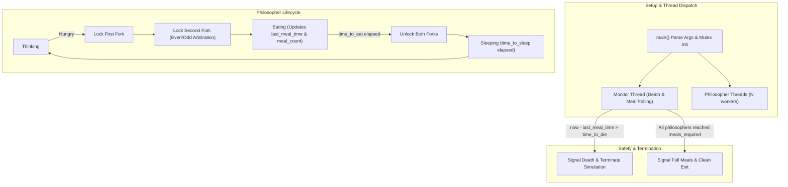

# Philosophers — Concurrent Resource Synchronization in C

[](https://github.com/higrub89/Philosophers/actions/workflows/ci.yml)
[](https://en.wikipedia.org/wiki/C99)
[](https://pubs.opengroup.org/onlinepubs/9699919799/basedefs/pthread.h.html)
[](https://clang.llvm.org/docs/ThreadSanitizer.html)
[](https://valgrind.org/docs/manual/hg-manual.html)
[](https://valgrind.org/)
[](https://www.42madrid.com/)
[](LICENSE)

## Overview

**Philosophers** is a multithreaded systems programming project from the 42 School curriculum addressing Edsger Dijkstra’s classic **Dining Philosophers Problem**.

The challenge requires orchestrating concurrent threads competing for shared, exclusive resources (forks) under microsecond-level timing constraints, with strict guarantees against **deadlocks**, **starvation**, and **data races**.

---

## Concurrency Architecture & State Machine



---

## Concurrency Invariants & Guarantees

1. **Deadlock Prevention (Resource Hierarchy & Even/Odd Scheduling)**:
   - To break Dijkstra's circular wait condition (*Coffman condition 4*), odd and even philosophers stagger their initial acquisition order and timing, preventing all philosophers from simultaneously picking up their left fork.
2. **Deterministic Mutex Protection**:
   - Every read and write to shared state (`last_meal_time`, `meals_eaten`, `simulation_should_end`) is strictly guarded by dedicated mutexes (`sim_mutex`, `write_mutex`).
3. **Microsecond Precision & Non-Drifting Sleep**:
   - Rather than relying on inaccurate OS `usleep()` calls which can overshoot by milliseconds, intervals are governed by an active high-resolution polling loop (`gettimeofday`) checking timestamp thresholds in small slices.
4. **Single Philosopher Edge-Case**:
   - Handled gracefully: A single philosopher picks up the single available fork, waits until starvation (`time_to_die`), prints the death event, and exits cleanly without hanging.

---

## Build & Usage

The project follows 42 School's compilation rules (`-Wall -Wextra -Werror -pthread`):

```bash
# Build the binary
make

# Clean object files
make clean

# Full clean (removes objects and binary)
make fclean

# Recompile from scratch
make re

# Build with ThreadSanitizer (TSan) for runtime data-race detection
make tsan

# Build with AddressSanitizer (ASan) & LeakSanitizer
make debug
```

### Command Syntax

```bash
./philo number_of_philosophers time_to_die time_to_eat time_to_sleep [number_of_times_each_philosopher_must_eat]
```

* **`number_of_philosophers`**: Number of philosophers and forks (e.g. `4`).
* **`time_to_die`**: Time in milliseconds before a philosopher dies if they haven't eaten.
* **`time_to_eat`**: Time in milliseconds spent eating while holding both forks.
* **`time_to_sleep`**: Time in milliseconds spent sleeping.
* **`[number_of_times_each_philosopher_must_eat]`** *(Optional)*: If specified, the simulation stops when all philosophers have eaten at least this many times.

### Benchmark Examples

```bash
# Must survive indefinitely (no deaths)
./philo 4 410 200 200

# Odd number of philosophers (must survive indefinitely)
./philo 5 800 200 200

# Strict meal limit (must stop automatically after 28 total meals)
./philo 4 410 200 200 7

# Single philosopher edge case (dies at precisely 400ms)
./philo 1 400 200 200
```

---

## Verification & Auditing Suite

The codebase is continuously verified using industry-standard dynamic analysis tools:

### 1. ThreadSanitizer (TSan)
```bash
make tsan
./philo 4 410 200 200 5
```
*Result: 0 data races, 0 thread leaks.*

### 2. Helgrind (Lock Contention & Deadlocks)
```bash
valgrind --tool=helgrind --error-exitcode=42 ./philo 4 410 200 200 2
```
*Result: 0 lock order violations, 0 race conditions.*

### 3. Valgrind Memcheck (Memory Leaks)
```bash
valgrind --leak-check=full --show-leak-kinds=all --track-origins=yes ./philo 4 410 200 200 3
```
*Result: All heap blocks freed deterministically. 0 bytes leaked in 0 blocks.*

---

## License

This project is licensed under the [MIT License](LICENSE).
